# 💫 About Me
Hello, I'm Roberto Guarneros. I have two degrees: Aerospace Engineering and Network Engineering.

I'm passionate about creating innovative solutions that span hardware, firmware, and software.

I’ve worked at the Nanosat Lab (software for the 3Cat-8 on-board computer) and collaborated with SEAT-CUPRA on solutions that streamline car development and reduce costs.

## 🌐 Socials

# 💻 Tech Stack
                             

# 📊 Highlights
<!-- Static cards generated daily by GitHub Actions -->

<!--  -->

